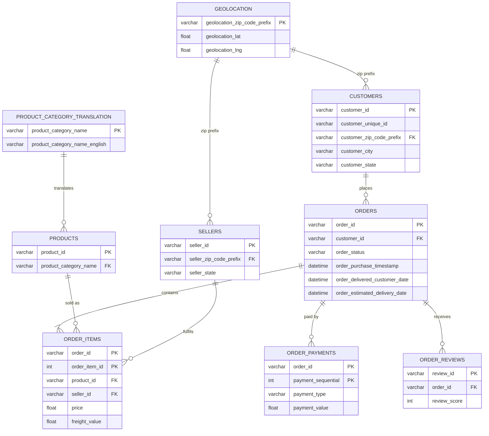

# 🛒 Cart2Insights: Decoding E-Commerce Performance

> An end-to-end e-commerce analytics solution built with **Python, Pandas, MySQL, SciPy and Streamlit**. It turns nine raw, related CSV tables into clean data, engineered business features, statistical evidence, SQL-driven analysis and an interactive dashboard.


---

## 📑 Table of Contents

1. [Project Overview](#-project-overview)
2. [Problem Statement](#-problem-statement)
3. [Business Use Cases](#-business-use-cases)
4. [Dataset & ER Diagram](#-dataset--er-diagram)
5. [Tech Stack](#-tech-stack)
6. [Project Structure](#-project-structure)
7. [Project Workflow](#-project-workflow)
8. [Feature Engineering](#-feature-engineering)
9. [Statistical Analysis](#-statistical-analysis)
10. [Streamlit Dashboard](#-streamlit-dashboard)
11. [Key Business Insights](#-key-business-insights)
12. [Recommendations](#-recommendations)
13. [Setup & Installation](#-setup--installation)
14. [How to Run](#-how-to-run)
15. [Security & Best Practices](#-security--best-practices)
16. [Limitations](#-limitations)
17. [Deliverables Checklist](#-deliverables-checklist)
18. [Future Enhancements](#-future-enhancements)
19. [Author](#-author)

---

## 📌 Project Overview

An e-commerce marketplace produces data across orders, products, sellers, payments, deliveries and customer reviews. Because this data lives in many related tables, overall business performance and customer behaviour are hard to see from raw files alone.

**Cart2Insights** solves this by building a complete analytics pipeline:

```
Raw CSVs → Quality Checks → Cleaning → MySQL → Feature Engineering → EDA → Statistical Tests → Streamlit Dashboard → Business Insights
```

**Headline numbers from the analysis**

| Metric | Value |
|---|---|
| Total revenue | **R$ 15,555,072.55** |
| Total orders | **99,163** |
| Unique customers | **95,828** |
| Sellers (with revenue) | **3,026** |
| Average order value | **R$ 156.86** |
| Peak revenue month | **2017-11** (R$ 1,156,317.23) |
| Avg. review score, on-time orders | **4.30** |
| Avg. review score, delayed orders | **2.56** |

---

## ❓ Problem Statement

The objective is to **analyse e-commerce data and uncover meaningful business insights** about sales, customers, products, sellers, payments, delivery performance and customer satisfaction, and to present them as actionable recommendations.

Key questions the project answers:

- How have sales and revenue changed over time, and which categories and states drive them?
- Who are the customers, and how many return after their first purchase?
- Which sellers and product categories contribute most to revenue?
- How reliable is delivery, and how do delays affect customer satisfaction?
- Do order value, payment method and order outcomes show statistically significant patterns?

---

## 💼 Business Use Cases

- E-commerce performance monitoring
- Customer behaviour and segmentation
- Sales and revenue optimisation
- Product and seller performance analysis
- Delivery and operational optimisation
- Customer experience improvement
- Data-driven business decision making

---

## 🗂️ Dataset & ER Diagram

The dataset (**Cart2Insights Dataset**) is the Brazilian Olist-style marketplace data, made up of **9 related tables**. Monetary values are in **Brazilian Real (R$)**.

| # | Table | Description | Primary Key |
|---|---|---|---|
| 1 | `customers` | Customer identifiers, ZIP prefix, city, state | `customer_id` |
| 2 | `geolocation` | ZIP prefix, latitude/longitude, city, state | `geolocation_zip_code_prefix` |
| 3 | `orders` | Order status and purchase/approval/delivery/estimated dates | `order_id` |
| 4 | `order_items` | Items per order with product, seller, price, freight | `(order_id, order_item_id)` |
| 5 | `order_payments` | Payment type, installments and value per order | `(order_id, payment_sequential)` |
| 6 | `order_reviews` | Review score, comments and timestamps | `review_id` |
| 7 | `products` | Category, dimensions, weight, photo count | `product_id` |
| 8 | `sellers` | Seller ZIP prefix, city, state | `seller_id` |
| 9 | `product_category_translation` | Portuguese → English category names | `product_category_name` |

### Entity-Relationship Diagram



> Column lists above are abbreviated. The full DDL with all columns and constraints is in `notebooks/04_sql_analysis.ipynb`.

---

## 🧰 Tech Stack

| Layer | Tools |
|---|---|
| Language | Python 3.10+ |
| Data processing | Pandas, NumPy |
| Database | MySQL, `mysql-connector-python` |
| Visualisation | Matplotlib, Seaborn, Plotly |
| Statistics | SciPy (`ttest_ind`, `f_oneway`, `chi2_contingency`, Shapiro-Wilk, Levene) |
| Dashboard | Streamlit |
| Notebooks | Jupyter |
| Version control | Git / GitHub |

---

## 📁 Project Structure

```
cart2insights/
│
├── data/
│   ├── raw/                          # Original 9 CSVs (NOT committed)
│   └── cleaned/                      # Cleaned CSVs produced by notebook 03 (NOT committed)
│
├── quality_report/                   # Data quality screenshots/outputs
│
├── notebooks/
│   ├── 01_data_understanding.ipynb
│   ├── 02_data_quality_analysis.ipynb
│   ├── 03_data_cleaning.ipynb
│   ├── 04_sql_analysis.ipynb         # Creates MySQL schema, loads data, runs SQL analysis
│   ├── 05_feature_engineering.ipynb
│   ├── 06_eda.ipynb
│   ├── 07_statistical_analysis.ipynb
│   ├── 08_business_insights_and_recommendations.ipynb
│   ├── feature_engineered_data/
│   │   ├── order_features.csv
│   │   ├── order_item_features.csv
│   │   ├── customer_features.csv
│   │   └── seller_features.csv
│   ├── eda_outputs/
│   │   ├── monthly_sales.csv
│   │   ├── category_sales.csv
│   │   ├── state_orders.csv
│   │   ├── seller_performance.csv
│   │   ├── customer_orders.csv
│   │   └── delivery_status_review.csv
│   └── statistical_analysis_results.csv
│
├── streamlit/
│   ├── app.py                        # Dashboard UI and navigation
│   ├── database.py                   # MySQL connection and table loaders
│   ├── queries.py                    # SQL queries used by the dashboard
│   └── utils.py                      # Formatting and display helpers
│
└── README.md
```

---

## 🔄 Project Workflow

### Step 1: Understand the business problem
Define the business context, objectives and the questions the analysis should answer.

### Step 2: Understand the dataset & ER diagram
Study the 9 tables, columns, data types, primary/foreign keys and relationships (`01_data_understanding.ipynb`).

### Step 3: Load raw data
Load all CSVs with Pandas and inspect shape, columns and data types.

### Step 4: Data quality analysis (`02_data_quality_analysis.ipynb`)
Missing values, duplicates, wrong data types, invalid values, potential outliers and primary-key uniqueness.

### Step 5: Data cleaning & preprocessing (`03_data_cleaning.ipynb`)
- Removed fully empty rows and exact duplicate rows
- Stripped whitespace from all text columns
- Standardised categorical values (lower-case `order_status`, `payment_type`, category names; upper-case state codes)
- Converted numeric columns (`price`, `freight_value`, `payment_value`, `review_score`, product dimensions) with safe coercion
- Parsed all order and review timestamps to `datetime`
- Set review scores outside 1–5 and negative prices/payments/dimensions to `NaN`
- Filled missing categorical values (`UNKNOWN` / `unknown`) and handled missing product categories
- Renamed misspelt columns (`product_name_lenght` → `product_name_length`, `product_description_lenght` → `product_description_length`)
- Saved the cleaned tables to `data/cleaned/`

### Step 6: Store cleaned data in SQL (`04_sql_analysis.ipynb`)
- Created the `cart2insights` database and all 9 tables from the ER diagram
- Applied primary-key and foreign-key constraints
- Loaded data in dependency order: `geolocation` → `translation` → `customers` / `sellers` / `products` → `orders` → `order_items` / `order_payments` / `order_reviews`
- Enforced referential integrity during load (ZIP prefixes normalised to 5 digits; child rows without a valid parent are dropped)
- Ran post-load LEFT JOIN checks to verify there are no orphan records

### Step 7: Feature engineering (`05_feature_engineering.ipynb`)
See [Feature Engineering](#-feature-engineering).

### Step 8: Exploratory data analysis (`06_eda.ipynb`)
Univariate, bivariate and multivariate analysis, trend analysis, correlation analysis and distribution analysis, with data pulled from SQL into Python.

### Step 9: Statistical analysis (`07_statistical_analysis.ipynb`)
Three hypothesis tests, each following: *Hypothesis → Test selection → Assumption checks → p-value → Decision → Business insight.*

### Step 10: SQL analysis & Streamlit dashboard
Business questions are answered in SQL using `SELECT / WHERE / ORDER BY`, `GROUP BY / HAVING`, joins, subqueries, CTEs, window functions and aggregations, then surfaced in the dashboard.

### Step 11: Business insights (`08_business_insights_and_recommendations.ipynb`)
Every major finding follows **Observation → Interpretation → Business Impact → Recommendation**.

---

## 🧮 Feature Engineering

| Feature | Level | Description |
|---|---|---|
| `total_order_value` | Order | Total value of an order |
| `delivery_days` | Order | Days from purchase to delivery to the customer |
| `delivery_delay` | Order | Actual delivery date minus estimated delivery date (days) |
| `is_delayed` | Order | `1` if delivered later than estimated, else `0` |
| `item_total_value` | Order item | `price + freight_value` |
| `customer_order_count` | Customer | Number of orders placed |
| `customer_total_spending` | Customer | Total amount spent |
| `average_order_value` | Customer | Spending divided by order count |
| `repeat_customer` | Customer | Indicator for customers with more than one order |
| `seller_revenue` | Seller | Total revenue generated by the seller |
| `seller_order_count` | Seller | Number of orders fulfilled by the seller |

Outputs are saved in `notebooks/feature_engineered_data/`.

---

## 📊 Statistical Analysis

All tests use **α = 0.05**.

| # | Test | Business Question | Statistic | p-value | Decision |
|---|---|---|---|---|---|
| 1 | Independent two-sample t-test (Welch) | Do delayed orders receive lower review scores than on-time orders? | t = −85.00 | ≈ 0 | **Reject H₀** |
| 2 | One-way ANOVA | Does average order value differ across product categories? | F = 167.97 | ≈ 0 | **Reject H₀** |
| 3 | Chi-square test of independence | Is payment method associated with order status? | χ² = 677.97 | 7.87 × 10⁻¹²⁵ | **Reject H₀** |

**Assumption checks performed**

- **t-test:** Shapiro-Wilk (sampled up to 5,000 per group) and Levene's test. Welch's t-test (`equal_var=False`) is used so equal variances are not required. With very large samples, normality tests are highly sensitive, so results are interpreted with that in mind.
- **ANOVA:** only categories with at least 30 observations are included; Levene's test checks homogeneity of variance.
- **Chi-square:** expected-frequency rule of thumb (share of cells with expected count < 5).

**Interpretation notes**

- Statistical significance does **not** prove causation or practical importance. With ~100k observations, even small differences become significant, so effect sizes matter.
- ANOVA shows that *at least one* category differs. It does not say which ones (a post-hoc test such as Tukey HSD would).
- Chi-square shows an association, not that payment method *causes* an order outcome.

Results are saved in `notebooks/statistical_analysis_results.csv`.

---

## 📈 Streamlit Dashboard

An interactive dashboard connected live to the MySQL database. Query results are cached (10-minute TTL) for responsiveness.

| Section | What it shows |
|---|---|
| **Business Overview** | Total revenue, orders, customers, sellers, average order value, average review score |
| **Sales Analysis** | Monthly revenue trend, revenue by category, top-selling products, sales by location |
| **Customer Analysis** | Customer distribution, spending segments, repeat vs new customers, top customers, monthly customer growth |
| **Seller & Product Analysis** | Top sellers, seller revenue, category performance, seller and category rankings |
| **Delivery Analysis** | Average delivery time, on-time vs delayed orders, delivery by location, monthly delivery performance, delay vs review score |
| **Customer Experience** | Review score distribution, reviews by category, rating vs delivery performance |
| **SQL Analysis** | Payment method analysis, order status analysis, payment vs order status |
| **Database Status** | Live connection status and row counts for all 9 tables |

---

## 💡 Key Business Insights

Each insight follows **Observation → Interpretation → Business Impact**.

### 1. Sales grew strongly, then the data tapers off
- **Observation:** Monthly revenue climbs sharply across the period, peaking in **2017-11** at R$ 1,156,317.23 across 7,521 orders. The dataset spans 2016-09 to 2018-10, and the first and last months have very few orders.
- **Interpretation:** The marketplace scaled quickly after launch. The thin first and last months are partial-period effects of the data window, not real collapses.
- **Impact:** Peak periods put pressure on inventory, seller capacity, payments and delivery, so demand planning matters.

### 2. Revenue leaders differ from volume leaders
- **Observation:** `beleza_saude` leads revenue (R$ 1,255,951.90), but `cama_mesa_banho` leads unit sales (11,087 units).
- **Interpretation:** Revenue and volume rankings differ, so a single metric gives an incomplete picture.
- **Impact:** Assortment, pricing and inventory decisions should look at both value and volume.

### 3. Sales are concentrated geographically
- **Observation:** **São Paulo (SP)** generates the most orders (41,731) and revenue (R$ 5,832,680.88), followed by RJ (12,839 orders) and MG (11,624 orders).
- **Interpretation:** Demand is concentrated in a few states.
- **Impact:** Logistics, warehousing and marketing can be prioritised there, while lower-volume states may be expansion opportunities.

### 4. Most customers buy only once
- **Observation:** Of 95,828 unique customers, **92,840 (96.88%)** are one-time buyers and only **2,988 (3.12%)** are repeat customers.
- **Interpretation:** The marketplace is strong at acquisition but weak at retention.
- **Impact:** Even a small lift in repeat purchase rate is a large revenue opportunity.

### 5. Delivery delays hurt satisfaction
- **Observation:** Delayed orders average **2.56** stars versus **4.30** for on-time orders, a gap of **1.73 points**. The t-test confirms the difference is significant. About **7,798 of 99,163 orders (≈7.9%)** were delivered late.
- **Interpretation:** Delivery experience is strongly associated with review scores.
- **Impact:** Improving delivery reliability is one of the most direct ways to raise customer satisfaction.

### 6. Seller contribution is uneven
- **Observation:** Across 3,026 sellers, the top seller earned R$ 229,302.63 from 1,131 orders.
- **Interpretation:** A relatively small group of sellers carries a large share of fulfilment.
- **Impact:** Operational problems at top sellers can affect many orders, so they need active monitoring.

### 7. Order fulfilment is healthy overall
- **Observation:** **96,214 orders (≈97.0%)** are delivered. The rest are mostly shipped (1,100), canceled (623) or unavailable (607).
- **Impact:** The core fulfilment flow works. Remaining losses are concentrated in cancellations and stock-outs.

---

## ✅ Recommendations

| Area | Recommendation |
|---|---|
| **Sales** | Use monthly trends to plan inventory, seller capacity and fulfilment ahead of peak periods such as November. |
| **Categories** | Track revenue and unit volume separately to guide assortment and stock decisions. |
| **Geography** | Prioritise logistics and campaigns in high-volume states (SP, RJ, MG) and investigate under-served regions. |
| **Customers** | Launch retention campaigns (follow-up offers, loyalty, post-purchase emails) for the 96.9% one-time buyers; cross-sell to repeat customers. |
| **Sellers** | Monitor top sellers on revenue, order count and review scores, and support underperforming ones. |
| **Delivery** | Improve delivery-time estimates and carrier performance, and proactively communicate with customers whose orders are at risk of delay. |
| **Customer experience** | Flag delayed orders early for service follow-up to limit low-rating risk. |
| **Payments** | Investigate which payment methods are linked to more cancellations or unavailable orders. |

---

## ⚙️ Setup & Installation

### Prerequisites

- Python 3.10 or higher
- MySQL Server 8.x running locally (or a reachable host)
- Git

### 1. Clone the repository

```bash
git clone https://github.com/<your-username>/cart2insights.git
cd cart2insights
```

### 2. Create a virtual environment

```bash
python -m venv venv
source venv/bin/activate        # macOS / Linux
venv\Scripts\activate           # Windows
```

### 3. Install dependencies

```bash
pip install pandas numpy matplotlib seaborn plotly scipy streamlit mysql-connector-python jupyter
```

> Tip: run `pip freeze > requirements.txt` afterwards so others can reproduce the environment with `pip install -r requirements.txt`.

### 4. Add the dataset

Download the **Cart2Insights Dataset** and place the 9 CSVs in `data/raw/`:

```
olist_customers_dataset.csv
olist_geolocation_dataset.csv
olist_order_items_dataset.csv
olist_order_payments_dataset.csv
olist_order_reviews_dataset.csv
olist_orders_dataset.csv
olist_products_dataset.csv
olist_sellers_dataset.csv
product_category_name_translation.csv
```

### 5. Create the MySQL database

```sql
CREATE DATABASE cart2insights;
```

### 6. Configure database credentials (never hardcode them)

Set environment variables:

```bash
# macOS / Linux
export MYSQL_HOST=localhost
export MYSQL_USER=root
export MYSQL_PASSWORD=your_password_here
export MYSQL_DATABASE=cart2insights
```

```powershell
# Windows PowerShell
$env:MYSQL_HOST="localhost"
$env:MYSQL_USER="root"
$env:MYSQL_PASSWORD="your_password_here"
$env:MYSQL_DATABASE="cart2insights"
```

Or, for Streamlit, create `streamlit/.streamlit/secrets.toml`:

```toml
MYSQL_PASSWORD = "your_password_here"
```

---

## ▶️ How to Run

Run the notebooks **in order** from the `notebooks/` folder:

| Order | Notebook | Purpose |
|---|---|---|
| 1 | `01_data_understanding.ipynb` | Explore tables, columns, keys |
| 2 | `02_data_quality_analysis.ipynb` | Detect data issues |
| 3 | `03_data_cleaning.ipynb` | Clean data → `data/cleaned/` |
| 4 | `04_sql_analysis.ipynb` | Create schema, load MySQL, run SQL analysis |
| 5 | `05_feature_engineering.ipynb` | Build business features |
| 6 | `06_eda.ipynb` | Exploratory analysis |
| 7 | `07_statistical_analysis.ipynb` | Hypothesis tests |
| 8 | `08_business_insights_and_recommendations.ipynb` | Insights and recommendations |

Then launch the dashboard:

```bash
cd streamlit
streamlit run app.py
```

The app opens at `http://localhost:8501`. If the database is unreachable, the sidebar shows the connection error and the dashboard stops safely.

---

## 🔒 Security & Best Practices

- **Do not commit credentials.** Read the password from `MYSQL_PASSWORD` or Streamlit secrets only.
- **Do not commit large datasets.** Keep `data/raw/` and `data/cleaned/` out of Git.
- Suggested `.gitignore`:

```gitignore
# Data
data/raw/
data/cleaned/

# Secrets
.env
.streamlit/secrets.toml

# Python
__pycache__/
*.pyc
venv/
.ipynb_checkpoints/
```

- Table names passed into dynamic SQL in `database.py` are validated against an allow-list.
- Use meaningful, regular Git commits and keep notebooks cleared of sensitive output before pushing.

---

## ⚠️ Limitations

- Insights are based on the supplied dataset and its date range. The first and last months are sparse and should not be read as trends.
- Statistical significance does not imply causation, and with very large samples tiny effects can be significant. Effect sizes should accompany p-values.
- ANOVA does not identify *which* categories differ, and chi-square shows association only.
- Some rows are dropped during SQL loading to satisfy foreign-key constraints (e.g. records without a matching ZIP prefix), which can cause small differences versus raw-file counts.
- "Revenue" figures are based on payment/order values in R$ and are not adjusted for inflation or returns.


## 🚀 Future Enhancements

- Customer segmentation using RFM analysis and clustering
- Delivery-delay prediction model
- Post-hoc tests (Tukey HSD) and effect-size reporting for ANOVA
- Sentiment analysis on review comments
- Cohort and retention analysis
- Deploy the dashboard to Streamlit Community Cloud with a hosted database

---

## 👤 Author

**kaveeshwar A**
📧 kaveeswarasok@gmail.com
🔗 [GitHub](https://github.com/kaveeshwarasok) · [LinkedIn](https://linkedin.com/in/a-kaveeshwar)


---

⭐ If you found this project useful, consider giving it a star!
